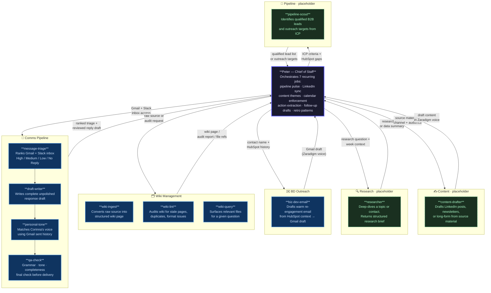

# Peter — Agent System Diagram

```mermaid
flowchart TD
    Peter["**Peter — Chief of Staff**\nOrchestrates 7 recurring jobs:\npipeline pulse · LinkedIn sync\ncontent themes · calendar enforcement\naction extraction · follow-up drafts · retro patterns"]

    subgraph SG1["📧 Comms Pipeline"]
        direction TB
        message-triage["**message-triage**\nRanks Gmail + Slack inbox\nHigh / Medium / Low / No Reply"]
        draft-writer["**draft-writer**\nWrites complete unpolished\nresponse draft"]
        personal-tone["**personal-tone**\nMatches Corinna's voice\nusing Gmail sent history"]
        qa-check["**qa-check**\nGrammar · tone · completeness\nfinal check before delivery"]
        message-triage --> draft-writer --> personal-tone --> qa-check
    end

    subgraph SG2["🗂️ Wiki Management"]
        direction TB
        wiki-ingest["**wiki-ingest**\nConverts raw source into\nstructured wiki page"]
        wiki-lint["**wiki-lint**\nAudits wiki for stale pages,\nduplicates, format issues"]
        wiki-query["**wiki-query**\nSurfaces relevant files\nfor a given question"]
    end

    subgraph SG3["✉️ BD Outreach"]
        direction TB
        biz-dev-email["**biz-dev-email**\nDrafts warm re-engagement email\nfrom HubSpot context → Gmail draft"]
    end

    subgraph SG4["🔍 Research  ·  placeholder"]
        direction TB
        researcher["**researcher**\nDeep-dives a topic or contact.\nReturns structured research brief"]
    end

    subgraph SG5["✍️ Content  ·  placeholder"]
        direction TB
        content-drafter["**content-drafter**\nDrafts LinkedIn posts, newsletters,\nor long-form from source material"]
    end

    subgraph SG6["🎯 Pipeline  ·  placeholder"]
        direction TB
        pipeline-scout["**pipeline-scout**\nIdentifies qualified B2B leads\nand outreach targets from ICP"]
    end

    Peter -->|"Gmail + Slack\ninbox access"| SG1
    SG1 -->|"ranked triage +\nreviewed reply draft"| Peter

    Peter -->|"raw source or\naudit request"| SG2
    SG2 -->|"wiki page /\naudit report / file refs"| Peter

    Peter -->|"contact name +\nHubSpot history"| SG3
    SG3 -->|"Gmail draft\n(Zaradigm voice)"| Peter

    Peter -->|"research question +\nweek context"| SG4
    SG4 -->|"research brief\nor data summary"| Peter

    Peter -->|"source material +\nchannel + audience"| SG5
    SG5 -->|"draft content\nin Zaradigm voice"| Peter

    Peter -->|"ICP criteria +\nHubSpot gaps"| SG6
    SG6 -->|"qualified lead list\nor outreach targets"| Peter

    classDef orchestrator fill:#1a1a2e,color:#e8e8ff,stroke:#5555ff,stroke-width:3px
    classDef existing fill:#0f3460,color:#d0e4ff,stroke:#4a90d9,stroke-width:2px
    classDef placeholder fill:#1a3020,color:#b0ffcc,stroke:#4aad7a,stroke-width:2px,stroke-dasharray:5 3

    class Peter orchestrator
    class message-triage,draft-writer,personal-tone,qa-check,wiki-ingest,wiki-lint,wiki-query,biz-dev-email existing
    class researcher,content-drafter,pipeline-scout placeholder
```
